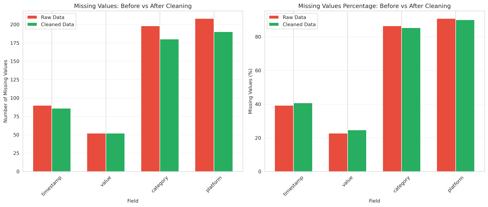
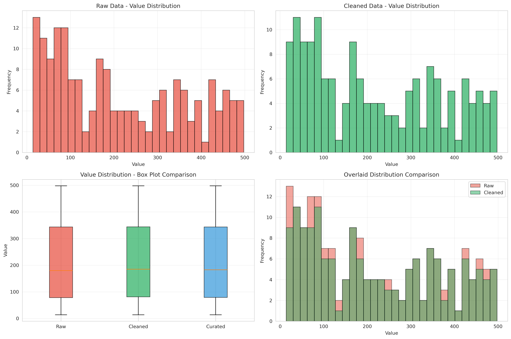
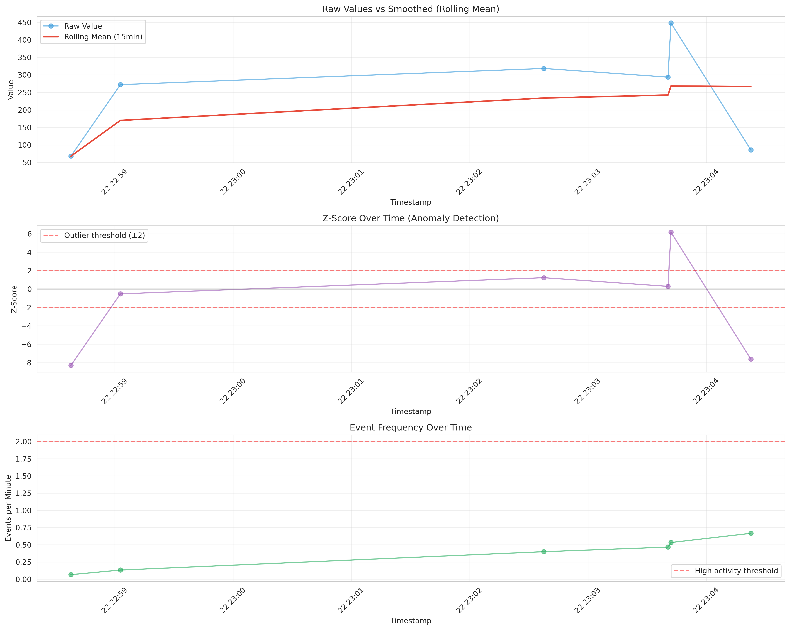
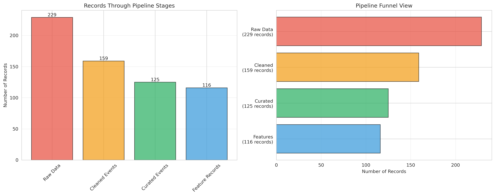
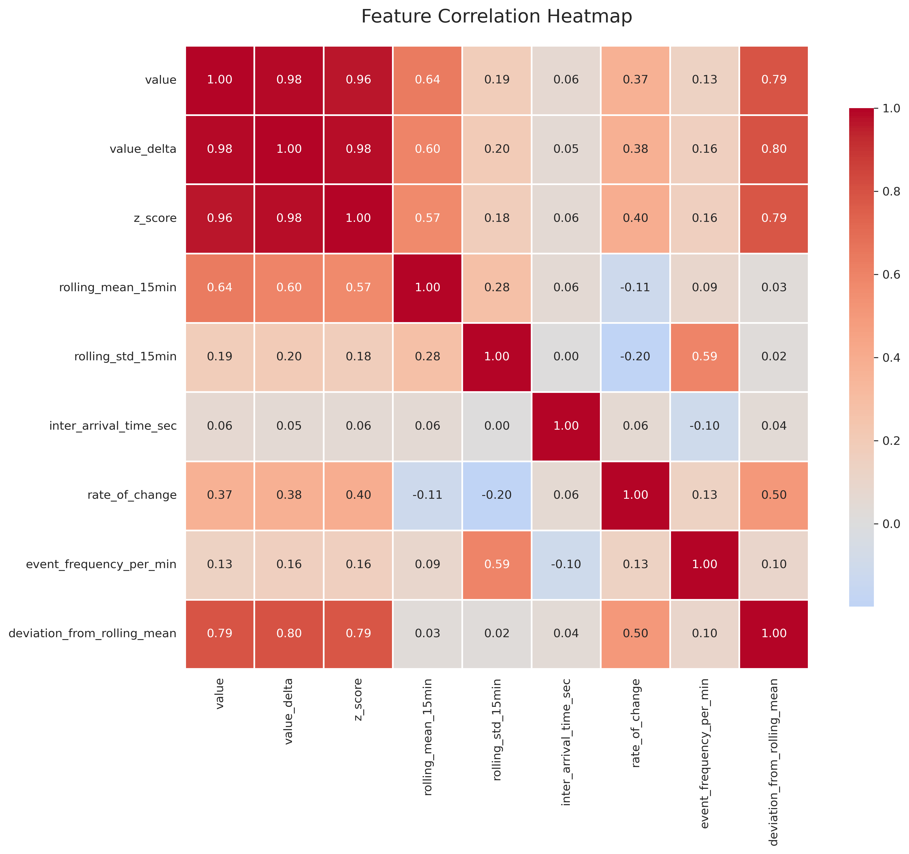

# Real-Time Data Cleaning & Feature Engineering Pipeline

## Project Overview
This project, for the Data Mining course at Universidad Politécnica de Yucatán, demonstrates an end-to-end real-time data preprocessing system using Apache Kafka and MongoDB. The core of the project is a pipeline that consumes intentionally "dirty" data streams, applies robust cleaning and validation rules, transforms and integrates the data, and engineers new features for analysis.

## System Architecture
The pipeline consists of four main Docker services:
1.  **Kafka**: The message broker that handles the data streams.
2.  **MongoDB**: The database for storing raw, cleaned, curated, and feature-enriched data.
3.  **Dirty Producer**: A custom Python script that generates noisy data for three Kafka topics (`dirty_events`, `dirty_metadata`, `dirty_reference`) to simulate real-world data quality issues.
4.  **Cleaning Pipeline**: A Python consumer service that performs all cleaning, transformation, and feature engineering logic.

## Data Quality Issues Injected
The producer intentionally introduces the following issues into the data stream:
- **Missing Fields**: Null values for timestamps and other fields.
- **Inconsistent Casing**: Categorical data like `platform` appears as 'Web', 'web', etc.
- **Duplicated Events**: The same `event_id` is sent multiple times.
- **Corrupted Data Types**: Numeric fields like `value` are sent as strings (e.g., "twenty").
- **Mixed Timestamp Formats**: Timestamps are sent as ISO strings, Unix epochs, and custom string formats.

## Cleaning Rules and Assumptions
The cleaning pipeline implements the following logic:
- **Timestamp Standardization**: All valid timestamps are converted to ISO 8601 format. Unparseable timestamps are set to `null`.
- **Type Enforcement**: Values are converted to their correct numeric types. Non-numeric values are converted to `null`.
- **Duplicate Removal**: Duplicate events are detected and dropped using a unique index on `event_id` in MongoDB.
- **Normalization**: String fields are converted to lowercase to ensure consistency.
- **Imputation**: Missing values are currently flagged or set to `null`. No complex imputation is performed.

## Transformation and Feature Engineering Logic
- **Integration**: Cleaned data streams are merged based on `entity_id` using a MongoDB aggregation pipeline.
- **Calculated Fields**: `value_delta`, `z_score`, and `is_outlier` are calculated to provide context.
- **Engineered Features**: Five new features, including rolling means and rate of change, are generated and stored in a separate collection. See `reports/features_dictionary.md` for details.

## How to Run the Pipeline
1.  **Prerequisites**: Docker and Docker Compose must be installed.
2.  **Build and Run**: From the root of the project directory, run the following command:
    ```bash
    docker-compose up --build
    ```
3.  **View Data**: Connect to MongoDB at `mongodb://localhost:27017/` and inspect the following collections: `raw_dirty`, `cleaned.events`, `curated.events`, and `curated.features`. To see the values, you have to run `sudo docker exec -it mongodb mongosh`.
4.  **Run Analysis**: To run the exploratory analysis, ensure you have a Jupyter environment. Execute the cells in `notebooks/exploration.ipynb`.

## Data Quality Improvement Summary
The cleaning pipeline significantly improves data quality. Below is a comparison of the `value` distribution and `platform` categories before and after processing.

**Missing Values Comparison**


**Value Distributions**


**Time Series Analysis**


**Pipeline Flow:**


**Feature Correlations:**

